# Архитектурный отчёт Т-Card

## Платформа рекрутинга промышленного персонала

**Версия документа:** 1.0  
**Дата:** 15 августа 2025  
**Стек:** React 19, TypeScript 5.7, Vite 8, Tailwind CSS 4, React Router 7

---

## Оглавление

1. [Обзор системы](#1-обзор-системы)
2. [Архитектурная диаграмма (C4 — Container)](#2-архитектурная-диаграмма-c4--container)
3. [Архитектура фронтенда](#3-архитектура-фронтенда)
4. [Архитектура бэкенда (проектируемая)](#4-архитектура-бэкенда-проектируемая)
5. [Диаграмма базы данных (ER)](#5-диаграмма-базы-данных-er)
6. [Диаграмма классов доменной модели](#6-диаграмма-классов-доменной-модели)
7. [Сценарий: Отклик соискателя на вакансию](#7-сценарий-отклик-соискателя-на-вакансию)
8. [Сценарий: Приглашение на собеседование (работодатель)](#8-сценарий-приглашение-на-собеседование-работодатель)
9. [Сценарий: Авторизация и выбор роли](#9-сценарий-авторизация-и-выбор-роли)
10. [Сценарий: Создание и публикация вакансии](#10-сценарий-создание-и-публикация-вакансии)
11. [Диаграмма состояний отклика (Application State Machine)](#11-диаграмма-состояний-отклика-application-state-machine)
12. [Диаграмма состояний вакансии (Vacancy State Machine)](#12-диаграмма-состояний-вакансии-vacancy-state-machine)
13. [Диаграмма пакетов (Component Diagram)](#13-диаграмма-пакетов-component-diagram)
14. [Структура проекта](#14-структура-проекта)
15. [State Management](#15-state-management)
16. [Безопасность и авторизация](#16-безопасность-и-авторизация)
17. [Развёртывание](#17-развёртывание)

---

## 1. Обзор системы

Т-Card — платформа для подбора промышленного персонала (рабочие специальности и ИТР). Система объединяет две роли:

- **Соискатель (Employee)** — поиск вакансий, отклики, оценка компетенций, развитие, резюме
- **Работодатель (Employer)** — управление вакансиями, кандидатами, откликами, аналитика

Платформа поддерживает два типа специальностей:
- **Рабочие специальности** — с тарифными разрядами (1–6), допусками (электробезопасность, работы на высоте и т.д.)
- **ИТР (инженерно-технические работники)** — с требованиями (ЕСКД, ГОСТ, САПР, грейды 5/7/8)

### Ключевые бизнес-процессы

| Процесс | Участники | Результат |
|---------|-----------|-----------|
| Отклик на вакансию | Соискатель | Создание заявки со статусом "pending" |
| Рассмотрение отклика | Работодатель | Переход в "invitation" или "rejected" |
| Назначение собеседования | Работодатель | Создание интервью, переход в "interview" |
| Оценка компетенций | Соискатель | Подтверждение разряда, заполнение профиля |
| Развитие (треки) | Соискатель | Прохождение чекпоинтов, обучение |
| Создание вакансии | Работодатель | Публикация вакансии из шаблона или с нуля |

---

## 2. Архитектурная диаграмма (C4 — Container)

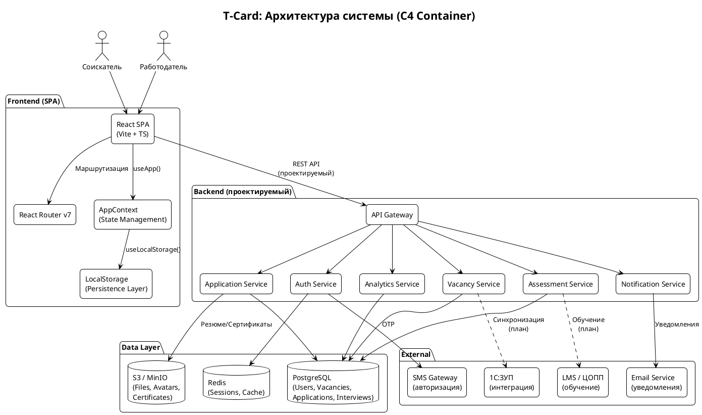

---

## 3. Архитектура фронтенда

```plantuml
@startuml Frontend_Architecture
!theme plain
skinparam backgroundColor #FFFFFF
skinparam roundCorner 10
skinparam packageStyle folder

title Архитектура фронтенда (детально)

package "Entry Point" {
  [main.tsx] as Main
  [App.tsx\n(Router + Guards)] as App
  [index.css\n(Tailwind v4)] as CSS
}

package "Context Layer" {
  [AppProvider] as Provider
  [AppContext\n(role, user, settings,\nbookmarks, applications,\nresumes, savedSearches)] as Context
}

package "Hooks" {
  [useLocalStorage<T>] as HookLS
}

package "Layout Components" {
  [EmployeeLayout\n(Sidebar + Header)] as EmLayout
  [EmployerLayout\n(Sidebar + Header)] as ErLayout
  [AuthLayout\n(Phone + Code flow)] as AuthLayout
}

package "Employee Pages" as EmpPkg {
  [Home] as EmpHome
  [Vacancies\n(List + Detail)] as EmpVac
  [Applications\n(List + Detail)] as EmpApp
  [Search] as EmpSearch
  [Competence] as EmpComp
  [Assessments\n(List + Detail)] as EmpAssess
  [Development] as EmpDev
  [Resumes\n(List + Editor)] as EmpRes
  [Settings\n(Notifications + Settings)] as EmpSet
  [Profile] as EmpProfile
  [Auth\n(Login + Register)] as EmpAuth
}

package "Employer Pages" as ErPkg {
  [Home] as ErHome
  [Vacancies\n(List + Detail + Editor)] as ErVac
  [Candidates\n(List + Detail)] as ErCand
  [Applications\n(List + Detail)] as ErApp
  [Analytics] as ErAnal
  [Company\n(Profile + Edit)] as ErComp
  [Settings] as ErSet
  [Auth\n(Login + Register)] as ErAuth
}

package "UI Components" {
  [Card] as UICard
  [GreenBtn / OutlineBtn] as UIBtn
  [Chip / StatusBadge] as UIChip
  [Input / Select / Toggle] as UIInput
  [EmptyState / SuccessScreen] as UIEmpty
  [SectionHeader / ProgressBar] as UIHeader
}

package "Icons" {
  [Icons.tsx\n(20+ SVG иконок)] as Icons
}

package "Data Layer" {
  [mockData.ts\n(1274 строки:\nвакансии, кандидаты,\nотклики, оценки, треки,\nрезюме, уведомления,\nаналитика, шаблоны)] as Mock
  [types/index.ts\n(302 строки:\n20+ интерфейсов)] as Types
}

Main --> App
App --> Provider
Provider --> Context
Context --> HookLS
App --> EmLayout
App --> ErLayout
App --> AuthLayout

EmLayout --> EmpPkg
ErLayout --> ErPkg

EmpPkg --> UIComponents
ErPkg --> UIComponents
UIComponents --> Icons
EmpPkg --> Mock
ErPkg --> Mock
Mock --> Types

@enduml
```

---

## 4. Архитектура бэкенда (проектируемая)

```plantuml
@startuml Backend_Architecture
!theme plain
skinparam backgroundColor #FFFFFF
skinparam roundCorner 10
skinparam componentStyle rectangle

title Архитектура бэкенда (проектируемая, микросервисная)

cloud "API Gateway (Nginx / Traefik)" as Gateway

package "Auth Service" {
  [POST /auth/phone\n(отправка OTP)] as AuthPhone
  [POST /auth/verify\n(проверка кода)] as AuthVerify
  [POST /auth/register\n(регистрация)] as AuthReg
  [JWT Token\n(access + refresh)] as JWT
}

package "Vacancy Service" {
  [GET /vacancies\n(список + фильтры)] as VacList
  [GET /vacancies/:id\n(детали)] as VacDetail
  [POST /vacancies\n(создание)] as VacCreate
  [PUT /vacancies/:id\n(редактирование)] as VacEdit
  [PATCH /vacancies/:id/status\n(смена статуса)] as VacStatus
  [GET /vacancies/templates\n(шаблоны)] as VacTemplates
}

package "Application Service" {
  [GET /applications\n(отклики сотрудника)] as AppList
  [GET /applications/:id\n(детали отклика)] as AppDetail
  [POST /applications\n(создание отклика)] as AppCreate
  [PATCH /applications/:id/status\n(смена статуса)] as AppStatus
  [POST /applications/:id/interview\n(назначение собеседования)] as AppInterview
  [POST /applications/:id/chat\n(сообщение в чат)] as AppChat
}

package "Candidate Service" {
  [GET /candidates\n(список + поиск)] as CandList
  [GET /candidates/:id\n(детали)] as CandDetail
  [POST /candidates/:id/favorite\n(в избранное)] as CandFav
  [GET /candidates/match\n(подбор по вакансии)] as CandMatch
}

package "Assessment Service" {
  [GET /assessments\n(список оценок)] as AssessList
  [GET /assessments/:id\n(детали + вопросы)] as AssessDetail
  [POST /assessments/:id/submit\n(отправка ответов)] as AssessSubmit
  [GET /competence\n(профиль компетенций)] as Competence
}

package "Development Service" {
  [GET /tracks\n(треки развития)] as Tracks
  [POST /tracks/:id/checkpoint\n(отметка чекпоинта)] as Checkpoint
  [GET /programs\n(учебные программы)] as Programs
}

package "Notification Service" {
  [GET /notifications\n(список)] as NotifList
  [PATCH /notifications/:id/read\n(отметка прочитанным)] as NotifRead
  [WebSocket /ws\n(real-time)] as WS
}

package "Analytics Service" {
  [GET /analytics/overview\n(KPI)] as AnalOverview
  [GET /analytics/funnel\n(воронка найма)] as AnalFunnel
  [GET /analytics/vacancies\n(по вакансиям)] as AnalVac
}

package "Company Service" {
  [GET /company\n(профиль компании)] as CompProfile
  [PUT /company\n(редактирование)] as CompEdit
  [GET /company/departments\n(подразделения)] as CompDept
}

database "PostgreSQL" as PG
database "Redis" as RD
database "S3" as S3

Gateway --> AuthPhone
Gateway --> AuthVerify
Gateway --> AuthReg
Gateway --> VacList
Gateway --> VacDetail
Gateway --> VacCreate
Gateway --> VacEdit
Gateway --> VacStatus
Gateway --> VacTemplates
Gateway --> AppList
Gateway --> AppDetail
Gateway --> AppCreate
Gateway --> AppStatus
Gateway --> AppInterview
Gateway --> AppChat
Gateway --> CandList
Gateway --> CandDetail
Gateway --> CandFav
Gateway --> CandMatch
Gateway --> AssessList
Gateway --> AssessDetail
Gateway --> AssessSubmit
Gateway --> Competence
Gateway --> Tracks
Gateway --> Checkpoint
Gateway --> Programs
Gateway --> NotifList
Gateway --> NotifRead
Gateway --> WS
Gateway --> AnalOverview
Gateway --> AnalFunnel
Gateway --> AnalVac
Gateway --> CompProfile
Gateway --> CompEdit
Gateway --> CompDept

AuthVerify --> JWT
AuthReg --> PG
VacList --> PG
VacDetail --> PG
VacCreate --> PG
AppCreate --> PG
AppStatus --> PG
AppInterview --> PG
AppChat --> PG
CandList --> PG
CandMatch --> PG
AssessSubmit --> PG
Tracks --> PG
NotifList --> PG
AnalOverview --> PG
AnalFunnel --> PG
CompProfile --> PG

JWT --> RD : Сессии
WS --> RD : Pub/Sub

AppCreate --> S3 : Резюме
AssessSubmit --> S3 : Сертификаты

@enduml
```

---

## 5. Диаграмма базы данных (ER)

```plantuml
@startuml ER_Diagram
!theme plain
skinparam backgroundColor #FFFFFF
skinparam linetype ortho

title Диаграмма базы данных (ER)

entity "users" as users {
  *id : UUID <<PK>>
  --
  *phone : VARCHAR(20)
  *role : ENUM(employee, employer)
  name : VARCHAR(100)
  specialty : VARCHAR(100)
  grade : INT
  city : VARCHAR(100)
  about : TEXT
  photo_url : VARCHAR(255)
  created_at : TIMESTAMP
  updated_at : TIMESTAMP
}

entity "companies" as companies {
  *id : UUID <<PK>>
  --
  *name : VARCHAR(200)
  *inn : VARCHAR(12)
  industry : VARCHAR(100)
  address : TEXT
  verified : BOOLEAN
  rating : DECIMAL(2,1)
  reviews_count : INT
  user_id : UUID <<FK>> (owner)
}

entity "departments" as departments {
  *id : UUID <<PK>>
  --
  *company_id : UUID <<FK>>
  *name : VARCHAR(200)
}

entity "vacancies" as vacancies {
  *id : UUID <<PK>>
  --
  *company_id : UUID <<FK>>
  *title : VARCHAR(200)
  *city : VARCHAR(100)
  *salary_from : INT
  *salary_to : INT
  *experience : VARCHAR(50)
  grade : INT
  *shift : VARCHAR(20)
  *department_id : UUID <<FK>>
  *description : TEXT
  *category : VARCHAR(100)
  *status : ENUM(draft, active, paused, closed)
  views : INT
  responses : INT
  is_itr : BOOLEAN
  template_id : UUID <<FK>>
  created_at : TIMESTAMP
  updated_at : TIMESTAMP
}

entity "vacancy_admissions" as vac_admissions {
  *id : UUID <<PK>>
  --
  *vacancy_id : UUID <<FK>>
  *admission_name : VARCHAR(100)
}

entity "itr_requirements" as itr_req {
  *id : UUID <<PK>>
  --
  *vacancy_id : UUID <<FK>>
  *requirement : VARCHAR(50)
}

entity "vacancy_templates" as templates {
  *id : UUID <<PK>>
  --
  *title : VARCHAR(200)
  *category : VARCHAR(100)
  *city : VARCHAR(100)
  *salary_from : INT
  *salary_to : INT
  *experience : VARCHAR(50)
  grade : INT
  *shift : VARCHAR(20)
  *department : VARCHAR(200)
  *description : TEXT
  created_at : TIMESTAMP
}

entity "resumes" as resumes {
  *id : UUID <<PK>>
  --
  *user_id : UUID <<FK>>
  *specialty : VARCHAR(100)
  *experience : VARCHAR(50)
  *salary_from : INT
  *salary_to : INT
  *city : VARCHAR(100)
  is_active : BOOLEAN
  about : TEXT
  grade : INT
  education : VARCHAR(100)
  shift : VARCHAR(20)
  updated_at : TIMESTAMP
}

entity "resume_admissions" as res_admissions {
  *id : UUID <<PK>>
  --
  *resume_id : UUID <<FK>>
  *admission_name : VARCHAR(100)
}

entity "applications" as applications {
  *id : UUID <<PK>>
  --
  *user_id : UUID <<FK>>
  *vacancy_id : UUID <<FK>>
  *status : ENUM(pending, invitation, interview, rejected)
  *created_at : TIMESTAMP
  updated_at : TIMESTAMP
}

entity "application_stages" as stages {
  *id : UUID <<PK>>
  --
  *application_id : UUID <<FK>>
  *name : VARCHAR(100)
  *date : VARCHAR(50)
  *done : BOOLEAN
  *order : INT
}

entity "interviews" as interviews {
  *id : UUID <<PK>>
  --
  *application_id : UUID <<FK>>
  *date : VARCHAR(50)
  *time : VARCHAR(10)
  *format : ENUM(offline, online, phone)
  *address : TEXT
  comment : TEXT
  *status : ENUM(scheduled, confirmed, rescheduled, no_show, cancelled, completed)
}

entity "timeline_events" as timeline {
  *id : UUID <<PK>>
  --
  *application_id : UUID <<FK>>
  *type : ENUM(application_created, status_changed, interview_scheduled, interview_confirmed, interview_rescheduled, interview_no_show, interview_cancelled, interview_completed, rejected, comment)
  *author : VARCHAR(100)
  *timestamp : VARCHAR(100)
  comment : TEXT
}

entity "chat_messages" as chat {
  *id : UUID <<PK>>
  --
  *application_id : UUID <<FK>>
  *author : ENUM(employer, employee)
  *text : TEXT
  *created_at : TIMESTAMP
}

entity "assessments" as assessments {
  *id : UUID <<PK>>
  --
  *user_id : UUID <<FK>>
  *title : VARCHAR(200)
  *type : ENUM(test, case, simulation)
  *duration : VARCHAR(20)
  *deadline : VARCHAR(50)
  *status : ENUM(assigned, completed, expired)
  score : INT
  confirmed_grade : INT
  weak_zone : VARCHAR(100)
}

entity "assessment_questions" as questions {
  *id : UUID <<PK>>
  --
  *assessment_id : UUID <<FK>>
  *text : TEXT
  *options : JSONB
  *correct_index : INT
}

entity "assessment_topics" as topics {
  *id : UUID <<PK>>
  --
  *assessment_id : UUID <<FK>>
  *name : VARCHAR(100)
  *score : INT
}

entity "development_tracks" as tracks {
  *id : UUID <<PK>>
  --
  *user_id : UUID <<FK>>
  *goal : VARCHAR(200)
  *progress : INT
  assigned_by_employer : BOOLEAN
  *deadline : VARCHAR(50)
}

entity "checkpoints" as checkpoints {
  *id : UUID <<PK>>
  --
  *track_id : UUID <<FK>>
  *name : VARCHAR(200)
  *status : ENUM(done, reminder, planned)
  *date : VARCHAR(50)
}

entity "learning_programs" as programs {
  *id : UUID <<PK>>
  --
  *track_id : UUID <<FK>>
  *title : VARCHAR(200)
  *duration : VARCHAR(20)
  *format : VARCHAR(50)
  paid_by_employer : BOOLEAN
  modules_progress : INT
  modules_total : INT
}

entity "certificates" as certificates {
  *id : UUID <<PK>>
  --
  *user_id : UUID <<FK>>
  *title : VARCHAR(200)
  *issue_date : VARCHAR(50)
  *expiry_date : VARCHAR(50)
}

entity "notifications" as notifications {
  *id : UUID <<PK>>
  --
  *user_id : UUID <<FK>>
  *type : ENUM(new_response, assessment_completed, candidate_rejected, subscription, interview, invitation)
  *text : TEXT
  *time : VARCHAR(20)
  *date_group : ENUM(today, yesterday)
  *read : BOOLEAN
}

entity "saved_searches" as saved_searches {
  *id : UUID <<PK>>
  --
  *user_id : UUID <<FK>>
  *query : VARCHAR(200)
  *criteria : VARCHAR(200)
  notifications : BOOLEAN
}

entity "bookmarks" as bookmarks {
  *id : UUID <<PK>>
  --
  *user_id : UUID <<FK>>
  *vacancy_id : UUID <<FK>>
}

entity "user_admissions" as user_admissions {
  *id : UUID <<PK>>
  --
  *user_id : UUID <<FK>>
  *admission_name : VARCHAR(100)
}

' Relationships
users ||--o{ companies : "owns"
users ||--o{ resumes : "has"
users ||--o{ applications : "submits"
users ||--o{ assessments : "takes"
users ||--o{ development_tracks : "assigned"
users ||--o{ certificates : "holds"
users ||--o{ notifications : "receives"
users ||--o{ saved_searches : "saves"
users ||--o{ bookmarks : "bookmarks"
users ||--o{ user_admissions : "has"

companies ||--o{ departments : "has"
companies ||--o{ vacancies : "publishes"

departments ||--o{ vacancies : "contains"

vacancies ||--o{ vacancy_admissions : "requires"
vacancies ||--o{ itr_requirements : "requires (ITR)"
vacancies ||--o{ applications : "receives"
vacancies ||--o{ bookmarks : "saved by"

templates ||--o{ vacancies : "creates from"

resumes ||--o{ resume_admissions : "lists"

applications ||--o{ application_stages : "tracks"
applications ||--|| interviews : "has (0..1)"
applications ||--o{ timeline_events : "logs"
applications ||--o{ chat_messages : "contains"

assessments ||--o{ assessment_questions : "has"
assessments ||--o{ assessment_topics : "scores"

development_tracks ||--o{ checkpoints : "has"
development_tracks ||--o{ learning_programs : "recommends"

@enduml
```

---

## 6. Диаграмма классов доменной модели

```plantuml
@startuml Class_Diagram
!theme plain
skinparam backgroundColor #FFFFFF
skinparam classAttributeIconSize 0

title Доменная модель (TypeScript интерфейсы)

enum Role {
  employee
  employer
}

enum VacancyStatus {
  draft
  active
  paused
  closed
}

enum ApplicationStatus {
  pending
  invitation
  interview
  rejected
}

enum InterviewFormat {
  offline
  online
  phone
}

enum InterviewStatus {
  scheduled
  confirmed
  rescheduled
  no_show
  cancelled
  completed
}

enum AssessmentStatus {
  assigned
  completed
  expired
}

class User {
  name: string
  phone: string
  role: Role
  specialty?: string
  grade?: number
  city?: string
  photo?: string
  about?: string
}

class Company {
  name: string
  inn: string
  industry: string
  address: string
  departments: string[]
  verified: boolean
  rating: number
  reviewsCount: number
}

class Vacancy {
  id: number
  company: string
  title: string
  city: string
  salaryFrom: number
  salaryTo: number
  experience: string
  grade: number
  admissions: string[]
  shift: string
  department: string
  description: string
  category: string
  vacancyStatus?: VacancyStatus
  isITR?: boolean
  itrRequirements?: string[]
  templateId?: number
}

class VacancyTemplate {
  id: number
  title: string
  category: string
  city: string
  salaryFrom: number
  salaryTo: number
  experience: string
  grade: number
  admissions: string[]
  shift: string
  department: string
  description: string
  createdAt: string
}

class Candidate {
  id: number
  name: string
  specialty: string
  grade: number
  gradeConfirmed: boolean
  city: string
  experience: string
  matchPercent: number
  admissions: string[]
  shift: string
  assessments: AssessmentTopic[]
  description?: string
}

class AssessmentTopic {
  name: string
  score: number
}

class Application {
  id: number
  vacancyId: number
  vacancyTitle: string
  company: string
  date: string
  status: ApplicationStatus
  stages: Stage[]
}

class Stage {
  name: string
  date: string
  done: boolean
}

class EmployerApplication {
  id: number
  candidateName: string
  candidateGrade: number
  candidateCity: string
  candidateExperience: string
  candidateDescription?: string
  matchPercent: number
  vacancyId: number
  vacancyTitle: string
  status: ApplicationStatus
  assessments: AssessmentTopic[]
  admissions: string[]
  shift: string
  interview?: Interview
  timeline: TimelineEvent[]
}

class Interview {
  date: string
  time: string
  format: InterviewFormat
  address: string
  comment: string
  status: InterviewStatus
}

class TimelineEvent {
  id: number
  type: TimelineEventType
  author: string
  timestamp: string
  comment?: string
}

class Assessment {
  id: number
  title: string
  type: AssessmentType
  duration: string
  deadline: string
  status: AssessmentStatus
  score?: number
  confirmedGrade?: number
  topics?: AssessmentTopic[]
  weakZone?: string
  questions?: AssessmentQuestion[]
}

class AssessmentQuestion {
  id: number
  text: string
  options: string[]
  correctIndex: number
}

class DevelopmentTrack {
  id: number
  goal: string
  progress: number
  assignedByEmployer: boolean
  deadline: string
  checkpoints: Checkpoint[]
  recommendedPrograms: LearningProgram[]
}

class Checkpoint {
  name: string
  status: CheckpointStatus
  date: string
}

class LearningProgram {
  id: number
  title: string
  duration: string
  format: string
  paidByEmployer: boolean
  modulesProgress?: number
  modulesTotal?: number
}

class Certificate {
  id: number
  title: string
  issueDate: string
  expiryDate: string | "permanent"
}

class Resume {
  id: number
  specialty: string
  experience: string
  salaryFrom: number
  salaryTo: number
  city: string
  active: boolean
  updatedAt: string
  about?: string
  admissions?: string[]
  grade?: number
  education?: string
  shift?: string
  stats: ResumeStats
}

class ResumeStats {
  favorites: number
  responses: number
  views: number
}

class AppNotification {
  id: number
  type: NotificationType
  text: string
  time: string
  dateGroup: string
  read: boolean
}

class SavedSearch {
  id: number
  query: string
  criteria: string
  notifications: boolean
}

class AppSettings {
  pinEnabled: boolean
  faceIdEnabled: boolean
  touchIdEnabled: boolean
  notificationsEnabled: boolean
  phone: string
  email: string
  name: string
}

User --> Role
Vacancy --> VacancyStatus
Vacancy --> VacancyTemplate : "templateId"
Vacancy ..> PublicationChannel : "channels"
Application --> ApplicationStatus
Application --> Stage
EmployerApplication --> ApplicationStatus
EmployerApplication --> Interview
EmployerApplication --> TimelineEvent
EmployerApplication --> AssessmentTopic
Interview --> InterviewFormat
Interview --> InterviewStatus
Assessment --> AssessmentStatus
Assessment --> AssessmentTopic
Assessment --> AssessmentQuestion
DevelopmentTrack --> Checkpoint
DevelopmentTrack --> LearningProgram
Resume --> ResumeStats
Candidate --> AssessmentTopic

@enduml
```

---

## 7. Сценарий: Отклик соискателя на вакансию

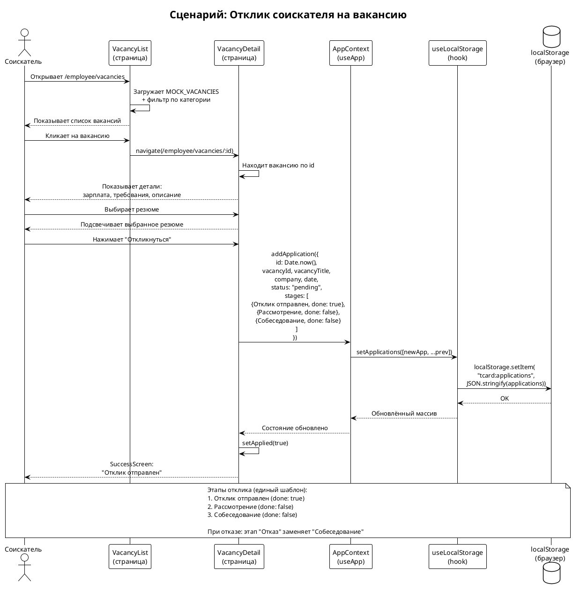

---

## 8. Сценарий: Приглашение на собеседование (работодатель)

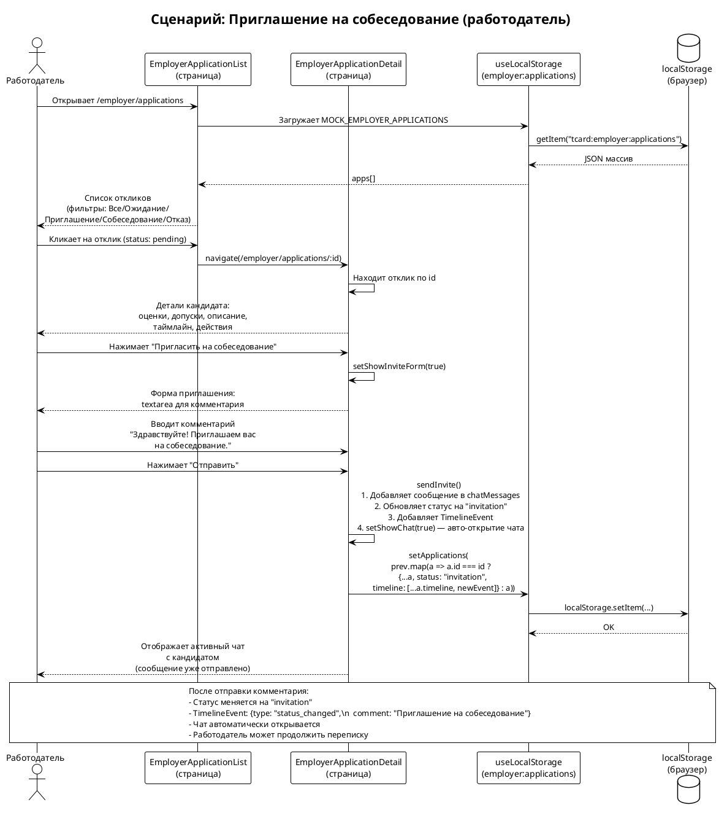

---

## 9. Сценарий: Авторизация и выбор роли

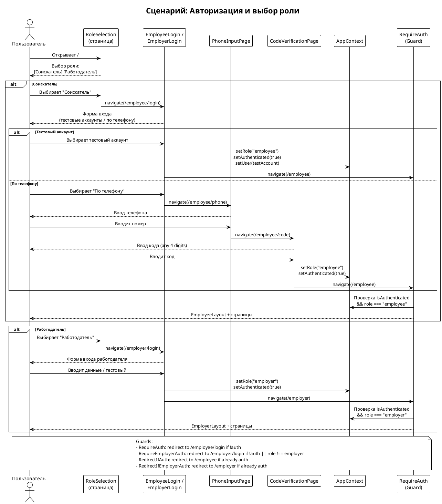

---

## 10. Сценарий: Создание и публикация вакансии

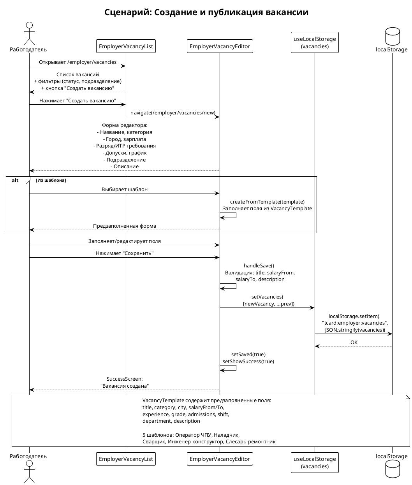

---

## 11. Диаграмма состояний отклика (Application State Machine)

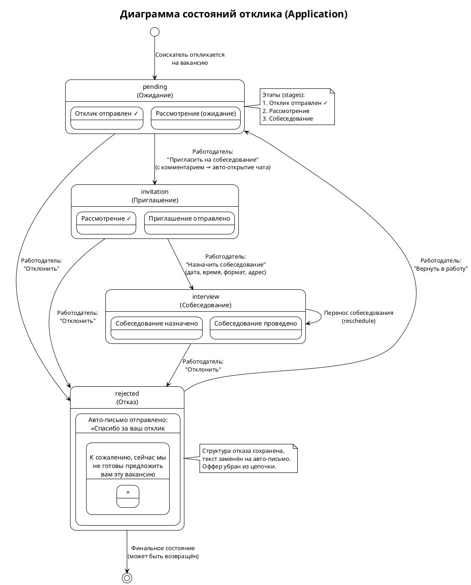

---

## 12. Диаграмма состояний вакансии (Vacancy State Machine)

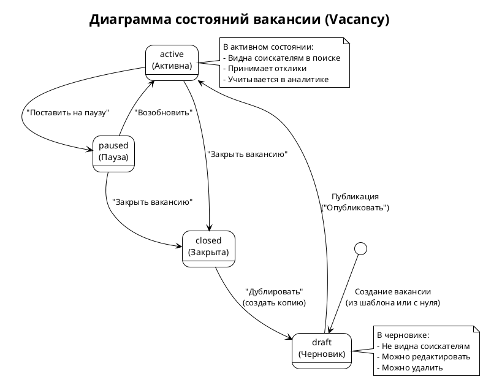

---

## 13. Диаграмма пакетов (Component Diagram)

```plantuml
@startuml Component_Diagram
!theme plain
skinparam backgroundColor #FFFFFF
skinparam componentStyle rectangle
skinparam packageStyle folder

title Диаграмма компонентов (Package Diagram)

package "src/" {
  package "main.tsx + App.tsx" as entry {
    [Router\n(Routes + Guards)]
    [AppProvider]
  }

  package "context/" {
    [AppContext]
  }

  package "hooks/" {
    [useLocalStorage]
  }

  package "types/" {
    [index.ts\n(20+ interfaces)]
  }

  package "data/" {
    [mockData.ts\n(1274 lines)]
  }

  package "components/" {
    package "layout/" {
      [EmployeeLayout]
      [EmployerLayout]
      [AuthLayout]
    }
    package "ui/" {
      [Card, GreenBtn, OutlineBtn]
      [Chip, StatusBadge, Input]
      [Select, Toggle, EmptyState]
      [SuccessScreen, SectionHeader]
      [ProgressBar]
    }
    package "icons/" {
      [Icons.tsx\n(20+ SVG icons)]
    }
  }

  package "pages/employee/" {
    [Home]
    [Vacancies]
    [Applications]
    [Search]
    [Competence]
    [Assessments]
    [Development]
    [Resumes]
    [Settings]
    [Profile]
    [Auth]
  }

  package "pages/employer/" {
    [Home]
    [Vacancies]
    [Candidates]
    [Applications]
    [Analytics]
    [Company]
    [CompanyEdit]
    [Settings]
    [Auth]
  }
}

entry --> AppContext
AppContext --> useLocalStorage
AppContext --> mockData : imports
entry --> EmployeeLayout
entry --> EmployerLayout
entry --> AuthLayout

EmployeeLayout --> pages/employee/
EmployerLayout --> pages/employer/

pages/employee/ --> components/ui/
pages/employer/ --> components/ui/
components/ui/ --> icons/
pages/employee/ --> mockData
pages/employer/ --> mockData
mockData --> types/

@enduml
```

---

## 14. Структура проекта

```
src/
├── main.tsx                    # Entry point — монтирование React
├── App.tsx                     # Роутинг + Guards (RequireAuth, RequireEmployerAuth)
├── index.css                   # Tailwind CSS v4 + глобальные стили
├── vite-env.d.ts               # Типы для Vite
│
├── context/
│   └── AppContext.tsx          # Глобальный state (role, user, settings, bookmarks, applications, resumes, savedSearches)
│
├── hooks/
│   └── useLocalStorage.ts      # Хук-обёртка над useState + localStorage (generic <T>)
│
├── types/
│   └── index.ts                # 20+ TypeScript интерфейсов (доменная модель)
│
├── data/
│   └── mockData.ts             # 1274 строки: mock-данные, дизайн-токены, константы, лейблы
│
├── components/
│   ├── layout/
│   │   ├── EmployeeLayout.tsx  # Sidebar + Header для соискателя (6 nav items)
│   │   ├── EmployerLayout.tsx  # Sidebar + Header для работодателя (7 nav items)
│   │   └── AuthLayout.tsx      # Layout для авторизации (phone + code flow)
│   ├── ui/
│   │   └── index.tsx           # 10+ UI компонентов (Card, GreenBtn, OutlineBtn, Chip, etc.)
│   └── icons/
│       └── Icons.tsx           # 20+ SVG иконок (Home, Search, Briefcase, Star, etc.)
│
├── pages/
│   ├── employee/               # 11 страниц соискателя
│   │   ├── Home.tsx            # Дашборд: статистика, рекомендации, треки
│   │   ├── Vacancies.tsx       # Список вакансий + детальная карточка + отклик
│   │   ├── Applications.tsx    # Список откликов + детальная карточка с этапами
│   │   ├── Search.tsx          # Поиск с фильтрами (разряд, допуски, город, график)
│   │   ├── Competence.tsx      # Профиль компетенций (радар-диаграмма по темам)
│   │   ├── Assessments.tsx     # Список оценок + прохождение теста
│   │   ├── Development.tsx     # Треки развития + учебные программы + сертификаты
│   │   ├── Resumes.tsx         # Список резюме + редактор
│   │   ├── Settings.tsx        # Уведомления + настройки (PIN, FaceID, push)
│   │   ├── Profile.tsx         # Профиль пользователя
│   │   └── Auth.tsx            # Авторизация (login + register, phone + code)
│   │
│   └── employer/               # 9 страниц работодателя
│       ├── Home.tsx            # Дашборд: KPI, последние отклики, активные вакансии
│       ├── Vacancies.tsx       # Список + детальная карточка + редактор вакансий
│       ├── Candidates.tsx      # Список кандидатов + детальная карточка
│       ├── Applications.tsx    # Список откликов + детальная карточка (таймлайн, чат, интервью)
│       ├── Analytics.tsx       # Аналитика: графики, воронка, топ-вакансии
│       ├── Company.tsx         # Профиль компании
│       ├── CompanyEdit.tsx     # Редактирование компании
│       ├── Settings.tsx        # Настройки работодателя
│       └── Auth.tsx            # Авторизация работодателя
│
└── assets/
    └── react.svg
```

---

## 15. State Management

### Текущая архитектура (Frontend-only)

Приложение использует **React Context + useLocalStorage** паттерн для управления состоянием:

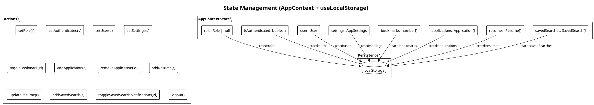

### Ключевые особенности

| Аспект | Реализация |
|--------|-----------|
| **Глобальный state** | React Context API (AppProvider) |
| **Персистентность** | useLocalStorage hook (sync с localStorage) |
| **Локальный state** | useState в компонентах (фильтры, формы, UI) |
| **Employer state** | useLocalStorage напрямую в компонентах (vacancies, applications, templates) |
| **Навигация** | React Router v7 (useNavigate, useParams, useLocation) |
| **Типизация** | TypeScript strict mode, 20+ интерфейсов |

### Хранение данных (localStorage keys)

| Key | Тип | Назначение |
|-----|-----|-----------|
| `tcard:role` | `Role \| null` | Текущая роль пользователя |
| `tcard:auth` | `boolean` | Флаг авторизации |
| `tcard:user` | `User` | Данные пользователя |
| `tcard:settings` | `AppSettings` | Настройки (PIN, FaceID, push, контакты) |
| `tcard:bookmarks` | `number[]` | ID закладок вакансий |
| `tcard:applications` | `Application[]` | Отклики соискателя |
| `tcard:resumes` | `Resume[]` | Резюме соискателя |
| `tcard:savedSearches` | `SavedSearch[]` | Сохранённые поиски |
| `tcard:employer:vacancies` | `Vacancy[]` | Вакансии работодателя |
| `tcard:employer:applications` | `EmployerApplication[]` | Отклики на вакансии работодателя |
| `tcard:employer:templates` | `VacancyTemplate[]` | Шаблоны вакансий |
| `tcard:notifications` | `AppNotification[]` | Уведомления |

---

## 16. Безопасность и авторизация

### Текущая реализация (Frontend-only)

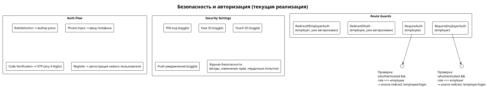

### Проектируемая безопасность (Backend)

| Механизм | Описание |
|----------|---------|
| **JWT (access + refresh)** | Access token — 15 мин, refresh — 7 дней |
| **OTP через SMS** | 4-значный код, срок жизни — 5 минут |
| **RBAC** | Role-Based Access Control (employee, employer) |
| **Rate limiting** | Защита от brute-force на OTP (3 попытки / 60 сек) |
| **HTTPS/TLS** | Транспортное шифрование |
| **CORS** Whitelist | Ограничение доменов |
| **Input validation** | Zod / class-validator на сервере |

---

## 17. Развёртывание

### Текущее развёртывание

```plantuml
@startuml Deployment
!theme plain
skinparam backgroundColor #FFFFFF
skinparam nodeStyle rectangle

title Развёртывание (текущее)

node "Vercel (CDN)" as Vercel {
  [Static Files\n(dist/)\nJS + CSS + HTML] as Static
}

node "Browser (Client)" as Browser {
  [React SPA] as SPA
  [localStorage] as LS
}

developer "Разработчик" as Dev

Dev -> Vercel : vercel deploy dist --prod
Vercel --> Static : CDN distribution
Browser -> Vercel : HTTPS GET /
Vercel --> Browser : index.html + JS + CSS
Browser -> SPA : Загрузка приложения
SPA -> LS : Чтение/запись state

@enduml
```

### Проектируемое развёртывание (Full-stack)

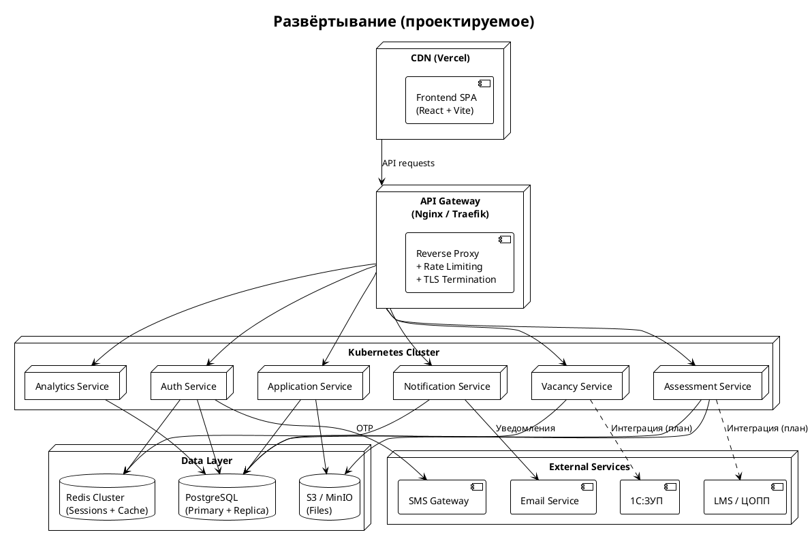

---

## Приложение А. Справочник типов

### Перечисления (Enums)

| Тип | Значения |
|-----|---------|
| `Role` | `employee`, `employer` |
| `VacancyStatus` | `draft`, `active`, `paused`, `closed` |
| `ApplicationStatus` | `pending`, `invitation`, `interview`, `rejected` |
| `InterviewFormat` | `offline`, `online`, `phone` |
| `InterviewStatus` | `scheduled`, `confirmed`, `rescheduled`, `no_show`, `cancelled`, `completed` |
| `AssessmentStatus` | `assigned`, `completed`, `expired` |
| `NotificationType` | `new_response`, `assessment_completed`, `candidate_rejected`, `subscription`, `interview`, `invitation` |

### Основные интерфейсы

| Интерфейс | Назначение | Кол-во полей |
|-----------|-----------|:------------:|
| `User` | Пользователь системы | 8 |
| `Company` | Компания-работодатель | 8 |
| `Vacancy` | Вакансия | 20 |
| `VacancyTemplate` | Шаблон вакансии | 12 |
| `Candidate` | Кандидат (со стороны работодателя) | 11 |
| `Application` | Отклик соискателя | 7 |
| `EmployerApplication` | Отклик (со стороны работодателя) | 15 |
| `Interview` | Собеседование | 6 |
| `TimelineEvent` | Событие таймлайна | 5 |
| `Assessment` | Оценка компетенций | 10 |
| `DevelopmentTrack` | Трек развития | 6 |
| `Resume` | Резюме | 13 |
| `AppNotification` | Уведомление | 6 |
| `AppSettings` | Настройки | 7 |
| `SavedSearch` | Сохранённый поиск | 4 |
| `Certificate` | Сертификат | 4 |

---

## Приложение Б. Бизнес-логика этапов найма

### Единый шаблон этапов (после рефакторинга)

```
Отклик отправлен → Рассмотрение → Собеседование
                                    ↓
                                  Отказ
```

| Этап | Кто инициирует | Статус | Действие |
|------|---------------|--------|----------|
| Отклик отправлен | Соискатель | `pending` | Создание Application |
| Рассмотрение | Работодатель | `pending` → `invitation` | Просмотр профиля, решение |
| Собеседование | Работодатель | `interview` | Назначение даты/формата |
| Отказ | Работодатель | `rejected` | Авто-письмо: «Спасибо за ваш отклик. К сожалению, сейчас мы не готовы предложить вам эту вакансию.» |

### Воронка найма (аналитика)

| Этап | Кол-во (mock) |
|------|:------------:|
| Просмотры | 523 |
| Отклики | 31 |
| Рассмотрение пройдено | 18 |
| Собеседование | 7 |
| Собеседование пройдено | 5 |
| Найм | 3 |

---

## Приложение В. Константы и справочники

| Справочник | Значения |
|-----------|---------|
| **SPECIALTIES** (16) | Оператор ЧПУ, Сварщик, Наладчик оборудования, Слесарь-монтажник, ... |
| **ITR_SPECIALTIES** (10) | Инженер-конструктор, Инженер-технолог, Инженер-проектировщик, ... |
| **CATEGORIES** (8) | Машиностроение, Металлообработка, Нефтегазовая, Пищевое производство, ... |
| **ADMISSIONS** (6) | Электробезопасность II/III, Работы на высоте, Стропальщик, ... |
| **SHIFTS** (3) | 2/2, 5/2, Вахта |
| **GRADES** (6) | 1, 2, 3, 4, 5, 6 |
| **ITR_REQUIREMENTS** (7) | ЕСКД, ЕСТД, ГОСТ, Сапр, Грейд 5, Грейд 7, Грейд 8 |
| **CONSTRUCTOR_DEPARTMENTS** (12) | Цех №1, Цех №2, Цех №3, Отдел расчётов, ... |

---

*Документ подготовлен на основе анализа исходного кода проекта Т-Card. Все диаграммы PlantUML можно отрендерить через [plantuml.com](https://www.plantuml.com/plantuml/uml/) или локально через `plantuml` CLI.*
